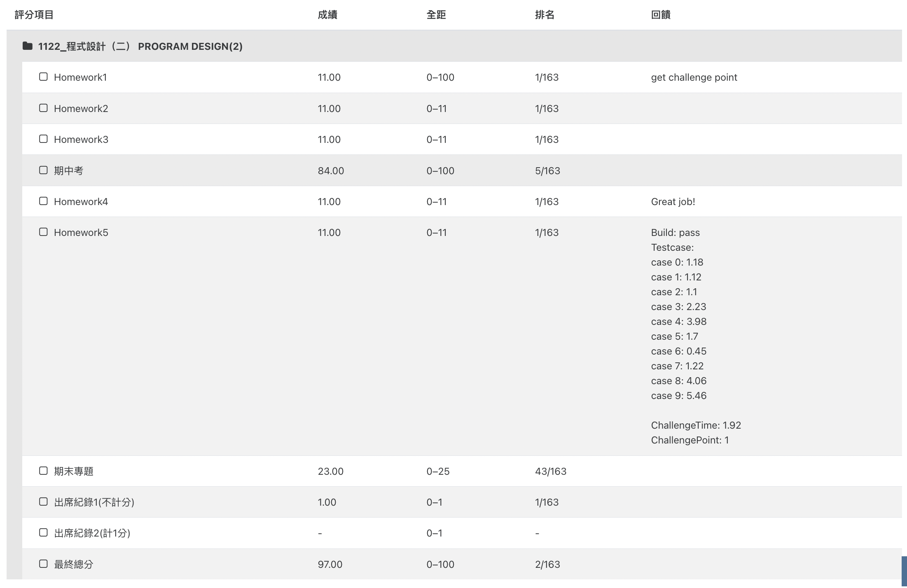

# NCKU PROGRAMMING DESIGN 2

## Description

Learning progress in Programming Design 2...
a lot more to go...
All updates of PD2 homework will be on here! 

## Table of Contents
- [Installation](#installation)
- [Usage](#usage)
- [Reference](#reference)

## Installation

[jsoup.jar](https://jsoup.org/download)

## Usage

[HW1](https://chuangkt.notion.site/PD2-Homework-1-3fce92cd9b504721bdefc0d214e9bad0)
[HW2](https://chuangkt.notion.site/PD2-Homework-2-925a35651a774200896af8c51bebc9a4)
[HW3](https://chuangkt.notion.site/PD2-Homework-3-f52f072e460d4308a60cc35d09a94e82)

## Reference
>

